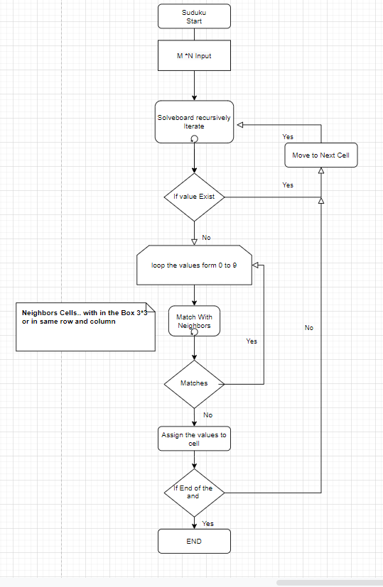

#Suduko Solution

## Table of contents
* [Input](#input)
* [Algorithm](#algorithm)
* [Setup](#setup)

	This assignment.py is python program to solve the given suduko Problem
	
   The given problem or suduko board is hardcorded as input M*N multidimentional array.
   
## Input
    Its is an array of [M][N]
    input = [
    [9, 0, 0, 1, 7, 0, 4, 0, 2],
    [1, 6, 0, 0, 4, 0, 0, 9, 5],
    [0, 0, 8, 0, 0, 3, 0, 0, 0],
    [0, 1, 0, 9, 0, 0, 5, 7, 3],
    [0, 4, 0, 0, 0, 0, 0, 2, 0],
    [5, 8, 9, 0, 0, 7, 0, 1, 0],
    [0, 0, 0, 4, 0, 0, 7, 0, 0],
    [6, 7, 0, 0, 2, 0, 0, 5, 8],
    [3, 0, 1, 0, 5, 8, 0, 0, 6]
    ];
    
## Algorithm 
    
    
    https://drive.google.com/file/d/1uMuff4KJ-XH5OgWjrLk2kL9mzJTwjr6w/view?usp=sharing
    
    1. intialize the given input in multidinentional array.
    2. iterate through each cell until end of that cell(x= M-1,y= N)
    3. Match the neighbor for (0-9)
    4. if there is no match assign that no to the cell
    5. move to next cell.repeat 3.
    6. Any step failed return with error.
    7. On Complte print Solved Suduko Board.
    
    
```
$ python3 assignment.py
```
or

```
$ sh run.sh
```

```
Output Solved Suduko Board: 

9 3 5 | 1 7 6 | 4 8 2 |
1 6 7 | 8 4 2 | 3 9 5 |
4 2 8 | 5 9 3 | 1 6 7 |
-----------------------
2 1 6 | 9 8 4 | 5 7 3 |
7 4 3 | 6 1 5 | 8 2 9 |
5 8 9 | 2 3 7 | 6 1 4 |
-----------------------
8 5 2 | 4 6 9 | 7 3 1 |
6 7 4 | 3 2 1 | 9 5 8 |
3 9 1 | 7 5 8 | 2 4 6 |
-----------------------
```
